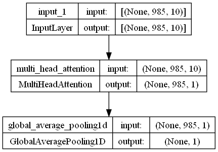
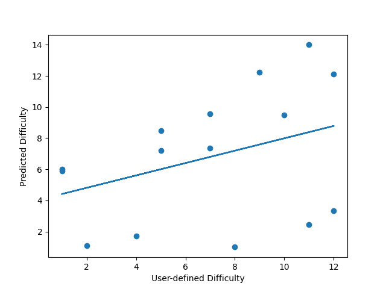

# RAITG
AI Difficulty estimation for In The Groove (ITG) technical charts

# Background
Stepmania is a free, desktop four-panel dance game inspired by Dance Dance Revolution (DDR) and colloquially known as "In The Groove" for its emulation of a now-defunct game of the same name. For the purposes of this project, I will be referring to the game and the Stepmania open-source program as In The Groove (ITG).

The first iterations of In The Groove software utilized a block difficulty rating system similar to that of old DDR titles. In this system, charts are assigned a numerical rating, generally 1 through 10, according to their perceived difficulty by the game developer. Over the past couple decades following the end of ITG's official releases, the game's community has expanded upon that premise through open-source software, such as Stepmania, capable of running player-created content. Much of today's custom ITG content entails "Technical Charts" (Tech, for short). As Tech charts utilize novel patterns requiring more complex movements for proper execution, content quickly exceeded the traditional guidelines of a 1 through 10 difficulty scale. Herein lies the problem to be addressed by this AI program.

As players created more difficult Tech charts, they adopted an expanded scale. In its current state, this scale typically runs up to a difficulty of 15, however a large majority of the difficult content played by the community lies in the small segment of 10 through 14. This provides very little granularity in distinguishing chart difficulties. Charts often may be perceived as noticably different from one another despite falling within the same difficulty block number. When coupled with the fact that such perception is derived from a very intricate set of traits for any given chart, the numerical difficulty system begins to lack meaning and precision in depicting a chart's difficulty.

# The Model
## First Approach
The initial design of the model utilizes a [Mutli-Headed Attention](https://keras.io/api/layers/attention_layers/multi_head_attention/) layer to identify features of a chart's note data most relevant to its perceived difficulty. These attention weights are then averaged across the pool to converge on a single numerical difficulty value to assign to the chart.

## First Predictions
Using this prototype, I briefly trained an instance of the model on 80% of the charts from the 7Guys1Pack collection of ITG Technical charts. This training went through 10 epochs and took roughly 60 seconds of CPU time, meaning it is very lightweight.

Then, I utilized the trained model to "predict" the difficulties of the remaining 20% of the charts from the same pack. The following depicts the results obtained from the model, as compared to the actual difficulties defined for the charts:

As can be seen by the successive predictions, the predicted values roughly correlate with the intended results (insofar as "harder" charts are rated higher than easier difficulties of the same song).
However, the model currently shifts in accuracy across successive predictions, with the most accurate being in the middle of the prediciton run. More test and adjustments to the model's design are necessary to adjust for this flaw.
